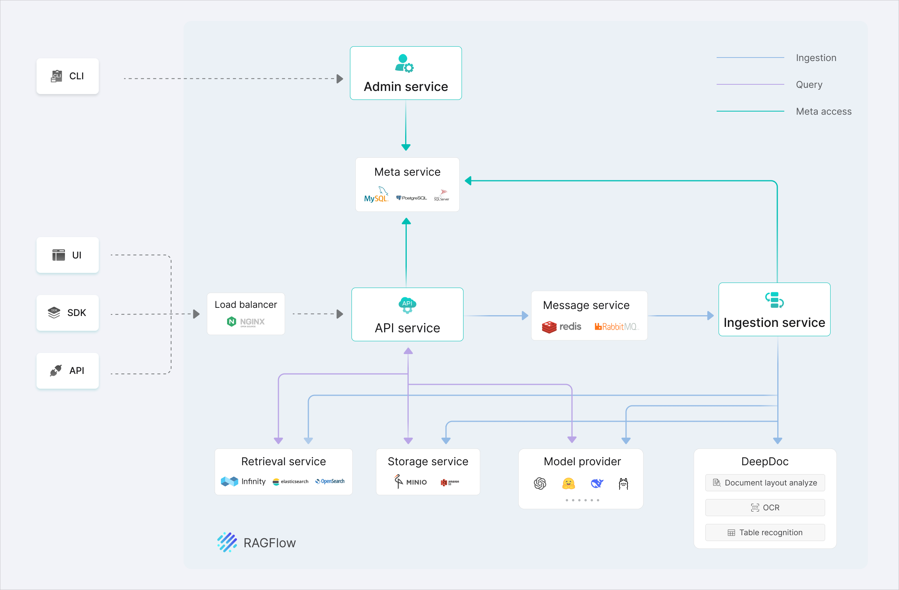
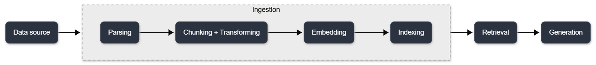
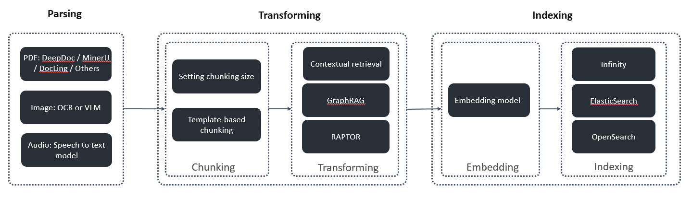

# What is RAGFlow?
import Tabs from '@theme/Tabs';
import TabItem from '@theme/TabItem';

RAGFlow is a leading Retrieval-Augmented Generation (RAG) engine that fuses cutting-edge RAG with agentic capabilities to create a superior context layer for LLMs.  

RAGFlow's powerful deep document parsing, transformation, and retrieval capabilities, complemented by orchestratable agents and workflows, enable companies to build best-in-class RAG systems that help LLMs deliver grounded, high-quality results.

## What does RAG do?

Today, companies and individuals increasingly rely more on LLMs for information retrieval and decision-making. However, LLMs can hallucinate when answering questions, especially when queries require domain-specific knowledge or up-to-date information not present in their training data. This can lead to incorrect or misleading answers.  

Retrieval-Augmented Generation (RAG) addresses this issue by fetching relevant context from an external knowledge base. It is an efficient and effective way to help LLMs ground their answers in retrieved information, reducing hallucinations and improving response accuracy. 

As AI agents gain popularity and become increasingly autonomous, they need frequent access to companies' knowledge bases, a wide variety of tools, and memory to have the necessary context for decision-making. RAG is playing an important role in accessing these sources and providing agents with the right context for them to function effectively.

## What makes RAGFlow unique as a RAG engine? 

Building a RAG system using the extraction-indexing-retrieval-generation pipeline is straightforward. However, these naive RAG systems usually face the following problems:
- Inability to provide effective question answering for unstructured multimodal documents
- Low recall and hit rates due to reliance solely on vector databases
- Inability to handle vague queries or multi-hop questions

How do you build a RAG system that addresses the problems above? This is where RAGFlow comes in. RAGFlow features the following strengths:
- A powerful ingestion pipeline that includes:
   - **Deep document parsing:** A robust data parsing module able to handle different data types and recognize complex structures, such as tables and text mixed with illustrations, producing high-quality data input from multimodal sources for your RAG system
   - **Semantic transformation:** Strong transforming capabilities to add semantic context to chunks, which bridges the semantic gap between raw data and user queries and helps retrieve more comprehensive relevant information for questions requiring multi-hop reasoning
   - **Hybrid retrieval:** Using an enterprise-ready search engine that supports hybrid search (vector search, semantic search, and sparse vector search) to boost recall
- An agent-based workflow that evaluates whether retrieved information aligns with user intents, breaks down complex multi-hop question answering, and allows for flexible orchestration of custom workflows.

With these capabilities, RAGFlow provides:
- **"Quality in, quality out"**
   - Deep document understanding-based knowledge extraction from unstructured data with complex formats
   - Reliable "needle in a haystack" retrieval across virtually unlimited document volumes
- **Template-based chunking**
   - Intelligent and explainable, and context-aware chunking
   - Plenty of template options to choose from
- **Grounded citations with reduced hallucinations**
   - Visualization of text chunking to allow human intervention
   - Quick view of the key references and traceable citations to support grounded answers
- **Compatibility with heterogeneous data sources**
   - Supports Word, Slides, Excel, TXT, images, scanned copies, structured data, web pages, and more.
- **Automated and effortless RAG workflow**
   - Streamlined RAG orchestration catered to both personal and large businesses
   - Configurable LLMs as well as embedding models
   - Multiple recall paired with fused re-ranking
   - Intuitive APIs for seamless integration with business applications

## What are the typical use cases of RAGFlow?
With RAGFlow, you can build agents that meet your various business demands. The following are some typical use cases:
- SQL assistant (NL2SQL): Converts your natural language instructions to accurate SQL statements to retrieve data from a database. This allows non-technical users  such as marketers and product managers to query business data independently without relying on data engineering teams.
- Customer support agent: Resolves complex customer requests effectively with deep knowledge base retrieval (such as product information and user guides) and transactional tool execution (such as booking an installation).   
- Research assistant: Performs multi-step information gathering across heterogeneous data sources (internal vector databases, local document repositories, and live web search). It then synthesizes multi-hop findings into structured, well-formatted research reports with traceable citations.

## What is the architecture of RAGFlow?

RAGFlow consists of the following components:
- **Backend System:** Handles document ingestion, deep parsing, storage, hybrid retrieval, and agent workflow orchestration.
- **User Interface (UI):** Enables users to upload datasets, configure custom chunking templates, orchestrate agent workflows, and evaluate retrieval performance.
- **Admin Console & CLI:** Provides administrative capabilities for monitoring system health, managing user permissions, and configuring system-level settings.

RAGFlow also provides APIs and SDKs, enabling developers to programmatically invoke its services and integrate RAG capabilities into enterprise infrastructure.

The following is an architecture diagram of RAGFlow:

## How does RAGFlow work?

RAG works by retrieving relevant data from designated sources and passing the data alongside the user query to an LLM. This provides necessary context for the LLM to generate accurate, grounded responses. 

A complete RAG workflow is as follows: Data source > ingestion > retrieval > generation

The ingestion pipeline covers parsing, chunking, transforming, embedding, and indexing. Its primary objective is to transform raw unstructured files into high-quality, searchable knowledge chunks for retrieval and generation.

flowchart LR
    %% ===== 主流程 =====
    DataSource[Data source] --> Ingestion
    Ingestion --> Retrieval[Retrieval]
    Retrieval --> Generation[Generation]

    %% ===== Ingestion 内部展开 =====
    subgraph Ingestion
        direction LR
        Parsing[Parsing] --> ChunkingTransform[Chunking + Transforming]
        ChunkingTransform --> Embedding[Embedding]
        Embedding --> Indexing[Indexing]
    end

    %% ===== 样式：严格匹配原图深色卡片风格 =====
    style DataSource fill:#2c3340,color:#f8f9fa,stroke:#444c5c,stroke-width:1px,rx:8px
    style Ingestion fill:#ececec,stroke:#444c5c,stroke-width:1px,stroke-dasharray:5 5
    style Parsing fill:#2c3340,color:#f8f9fa,stroke:#444c5c,stroke-width:1px,rx:8px
    style ChunkingTransform fill:#2c3340,color:#f8f9fa,stroke:#444c5c,stroke-width:1px,rx:8px
    style Embedding fill:#2c3340,color:#f8f9fa,stroke:#444c5c,stroke-width:1px,rx:8px
    style Indexing fill:#2c3340,color:#f8f9fa,stroke:#444c5c,stroke-width:1px,rx:8px
    style Retrieval fill:#2c3340,color:#f8f9fa,stroke:#444c5c,stroke-width:1px,rx:8px
    style Generation fill:#2c3340,color:#f8f9fa,stroke:#444c5c,stroke-width:1px,rx:8px
    

When using RAGFlow, you: 

1. **Connect Data Sources:** Connect external data sources or upload files directly.
2. **Ingest & Process Data:** Create knowledge datasets by running the ingestion pipeline. You can use RAGFlow's built-in parsing templates or build a custom agentic pipeline for granular control over chunking and processing.
3. **Create Chat Apps or Agents:** Configure a chat application or build a specialized AI agent. Upon receiving user queries, the app or agent queries the ingested dataset, retrieves relevant chunks, and synthesizes grounded answers.

### RAGFlow Ingestion Pipeline

RAGFlow's ingestion pipeline works as follows:

In each stage of the ingestion pipeline, RAGFlow offers different options that you can choose and orchestrate flexibly to best meet your business requirements.

At each stage of the ingestion pipeline, RAGFlow provides configurable methods, allowing you to fine-tune layout parsing, transforming, and indexing options to match your specific business domain and document structures.

    

